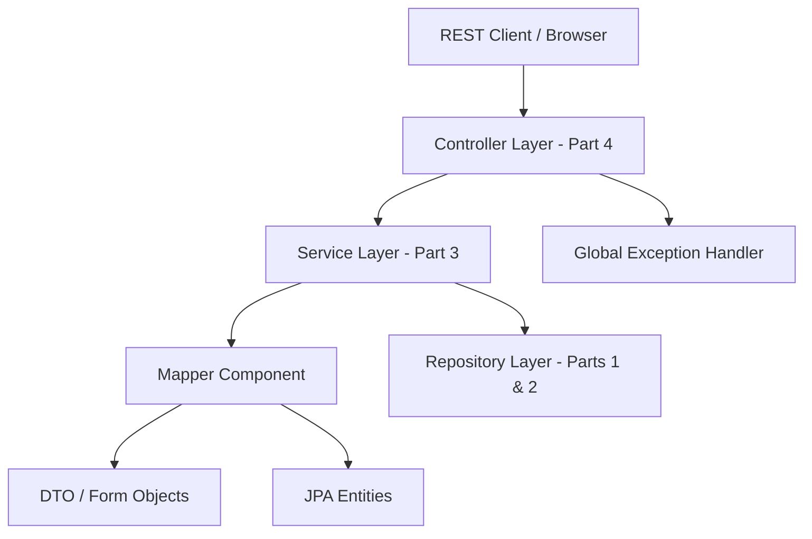
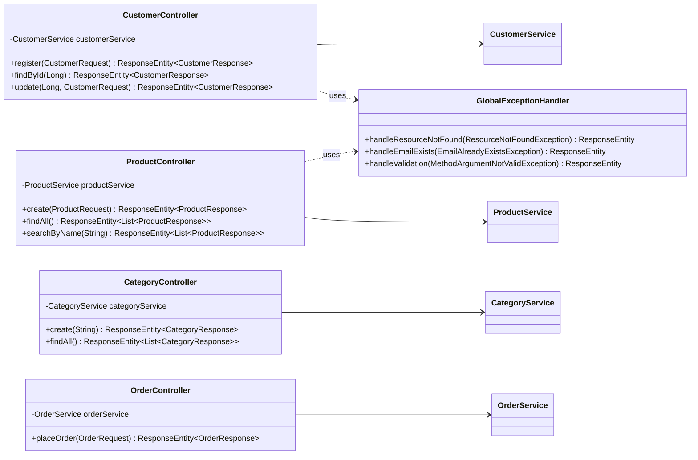

# Workshop: E-commerce Platform (Part 4)

## Objective

Evolve the system by implementing the **Controller Layer**, introducing **RESTful API endpoints**, and utilizing **Exception Handling** to create a complete and functional web service.

## Project Setup & Verification

This section continues from **Part 3**. Before implementing the controller layer:

1. **Create a new branch for Part 4**
2. **Review Dependencies**: Ensure the following dependencies are in `pom.xml`:
    - `spring-boot-starter-webmvc`
    - `spring-boot-starter-validation`
    - `springdoc-openapi-starter-webmvc-ui` (for API documentation):
      ```xml
      <dependency>
          <groupId>org.springdoc</groupId>
          <artifactId>springdoc-openapi-starter-webmvc-ui</artifactId>
          <version>2.8.5</version>
      </dependency>
      ```
3. **Verify App Start**: Run the application and ensure no errors are present.

---

## Architectural Overview: Layered Architecture

In Part 4, we complete the layered architecture by adding the **Controller Layer**. This layer will be responsible for receiving HTTP requests, validating input data, and returning HTTP responses.



---

## REST Controller Layer: Class Diagram

The following diagram illustrates how our Controllers interact with the Service Layer and the Exception Handler.



---

## Task 1: REST Controller Requirements

Create a package `se.lexicon.ecommerceworkshop.controller`. Annotate each class with `@RestController` and the appropriate `@RequestMapping`.

### 1. CustomerController
- **Base Path**: `/api/v1/customers`
- **Endpoints**:
    - `POST`: Create a new customer using `@RequestBody @Valid CustomerRequest`. Status: `201 Created`.
    - `GET /{id}`: Retrieve a customer by ID. Status: `200 OK`.
    - `PUT /{id}`: Update an existing customer. Status: `200 OK`.

### 2. ProductController
- **Base Path**: `/api/v1/products`
- **Endpoints**:
    - `POST`: Create a new product using `@RequestBody @Valid ProductRequest`. Status: `201 Created`.
    - `GET`: List all products. Status: `200 OK`.
    - `GET /search?name=...`: Search products by name using `@RequestParam`. Status: `200 OK`.

### 3. CategoryController
- **Base Path**: `/api/v1/categories`
- **Endpoints**:
    - `POST`: Create a new category. Status: `201 Created`.
    - `GET`: List all categories. Status: `200 OK`.

### 4. OrderController
- **Base Path**: `/api/v1/orders`
- **Endpoints**:
    - `POST`: Place a new order using `@RequestBody @Valid OrderRequest`. Status: `201 Created`.

---

## Task 2: Global Exception Handling

Implement a centralized exception handling mechanism to ensure your API returns consistent and meaningful error responses across all endpoints.

---

## Task 3: API Documentation (Swagger UI)

Configure Swagger UI using SpringDoc OpenAPI to provide interactive and auto-generated documentation for your REST API, making it easy to test and explore.

---

## Learning Goals
- **REST Principles**: Understand HTTP verbs (GET, POST, PUT, DELETE) and status codes.
- **Request Validation**: Use `@Valid` and `@RequestBody` to ensure incoming data is correct.
- **Response Management**: Use `ResponseEntity` to control headers and status codes.
- **Global Error Handling**: Centralize error logic for a consistent API response.

---

## Submission Checklist

- [ ] **Git Branch**: Create a feature branch for Part 4 (e.g., `feature/rest-api`).
- [ ] **Controllers**: Implement the required REST controllers with appropriate Spring annotations.
- [ ] **Endpoints**: Create the required REST endpoints for CRUD operations and searching.
- [ ] **Exception Handling**: Implement a Global Exception Handler for consistent error responses.
- [ ] **Validation**: Ensure that all incoming requests are properly validated.
- [ ] **Verification**: Use a REST client (like Postman or curl) to test all API endpoints and verify the correct HTTP status codes.
- [ ] **Swagger UI**: Verify that the API documentation is accessible at `/swagger-ui.html`.
- [ ] **Commits**: Make descriptive commits for each major step.
- [ ] **Push**: Push the branch to GitHub and provide the link.

---
